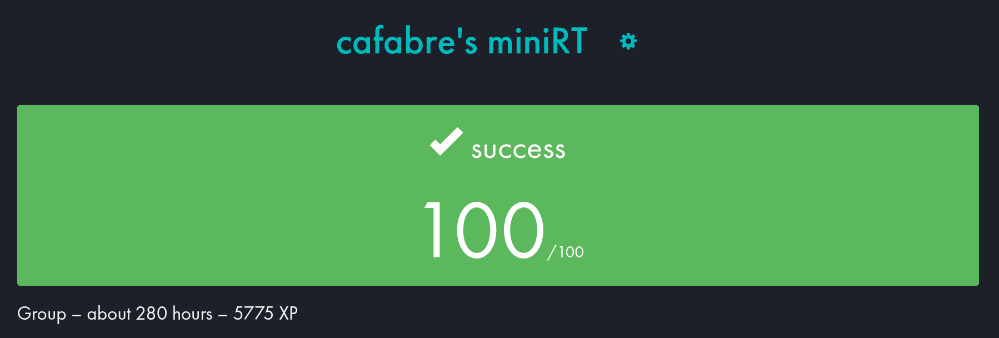

<p align="center">
	
</p>

<h1 align="center">🔦 MiniRT - Raytracing Engine</h1>

<p align="center">
	<i>42 School project - made in collaboration with <b>rshin</b></i>
</p>

<p align="center">
	
</p>

## 📖 Description
**MiniRT** is a project from **42 School**, developed in C using the **MiniLibX** graphical library.  
The goal is to build a simple **Raytracing engine** capable of rendering a 3D scene by simulating the behavior of light rays.

Unlike rasterization, raytracing works by shooting rays from the camera through each pixel of the screen and calculating which objects they intersect. The closest intersection defines what the pixel displays.

This project includes:

- A **custom parser** for `.rt` scene files
- Mathematical intersection handling for:
  - spheres
  - planes
  - cylinders
- Lighting management with:
  - **ambient light**
  - **spot light**
  - diffuse shading based on surface normals
- A camera system supporting orientation and FOV
- Real-time rendering with MiniLibX

Each object is rendered by computing:
- the ray-object intersection
- the nearest hit point
- the surface normal at that point
- the resulting color depending on lighting intensity

<p align="center">
	
</p>

## 🛠️ Installation & Compilation

### Prerequisites
* The `gcc` compiler
* **MiniLibX** (included as a submodule and automatically compiled by the Makefile)  
  *(if you are using MacOS, you may need to replace the MiniLibX version with the correct one for your system)*

### Instructions

#### 1. Clone the project
```bash
git clone --recurse-submodules git@github.com:cafabre/minirt.git
cd minirt
```

#### 2. Compile the program
```bash
make
```

## ⚙️ Usage
Run MiniRT with any `.rt` scene file located in the scenes/ folder (or your own custom scene file) like so :
```bash
./miniRT scenes/1_basic/basic1.rt
```
A valid `.rt` file contains a list of elements.
The order of lines does not matter, and spaces / tabs / empty lines are ignored.

### Mandatory elements
A scene must contain :

#### ✅ One camera
```bash
C coords[x,y,z] orientation[x,y,z] FOV
```
#### ✅ One light source
```bash
L coords[x,y,z] ratio color[r,g,b]
```
#### ✅ One ambient light
```bash
A ratio color[r,g,b]
```
### Optional elements
You can add as many objects as you want.
#### Plane
```bash
pl coords[x,y,z] orientation[x,y,z] color[r,g,b]
```
#### Sphere
```bash
sp coords[x,y,z] diameter color[r,g,b]
```
#### Cylinder
```bash
cy coords[x,y,z] orientation[x,y,z] diameter height color[r,g,b]
```

## 🧪 Provided test scenes
The project includes a full set of test scenes inside the `scenes/` folder:

- **0_bad** : invalid scenes that should not display anything (parsing tests)
- **1_basic** : simple scenes with few objects (basic rendering tests)
- **2_light** : same scene with different light positions
- **3_ambient** : tests for different ambient/spot light combinations
- **4_multi** : scenes containing more objects than the basic ones
- **5_perspective** : same scene with different camera positions and FOV
- **6_intersect** : scenes containing object intersections
- **7_fun** : complex scenes representing more "realistic" objects

⚠️ **Warning** : some scenes inside `7_fun` may take from a few seconds up to 2 minutes to render.

## 📸 Screenshots
<p align="center">
	 --> inserer une image de scene
</p>

<p align="center">
	 --> idem (en ajouter plusieurs)
</p>
